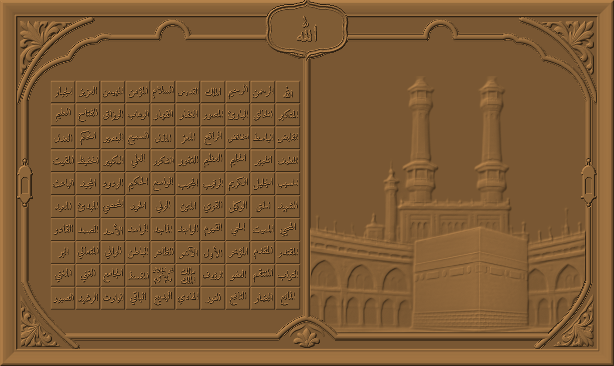

# 99 Names + Kaaba — framed panel, 72 × 43 in

A custom CNC carving: Allah and the 99 Names on raised tiles beside a Kaaba relief, in a carved frame
with corner florals, a cartouche and lanterns. Made 6–7 Oct 2026 from the customer's reference
(`reference.jpg`).

## Files

| File | What it is |
|---|---|
| `99-names-kaaba-framed-v3-72x43in-stl.zip` | **The carving file.** Binary STL inside, 120 MB unzipped. |
| `heightmap-16bit.png` | The same relief as a 16-bit greyscale image, for CAM software that prefers one. Black = background, white = 10 mm above it, 1 px = 0.65 mm (2815 × 1681 px). |
| `preview.png` | Shaded render of the height field. |
| `stl-top-view.png` | Top view rendered from the STL file itself (`scripts/qa/stl-top.py`), the check that the shipped file holds the design. Speckle is the renderer drawing a simplified mesh, not missing geometry. |
| `reference.jpg` | The customer's reference picture. |

## Size and heights

- Board 1828.8 × 1092.2 mm (72 × 43 in). The first reference picture was labelled 42 in; the order was 43 in.
- Letters raised **4.0 mm** above their tiles; tiles are 2.0 mm, so letter tops are 6.0 mm above the background.
- Outline straps and bands 5 mm, corner florals / fleur / lanterns 6 mm, Kaaba scene 0–8 mm, frame up to 10 mm.
- 3 mm base under everything so the file is a closed solid: STL is 12.98 mm thick overall.

## Text

- Allah plus the 99 Names come from the app's verified library (`NAMES_99` in `src/lib/textPanel.ts`), in
  al-Tirmidhi order, set in Amiri Bold (`public/fonts`) with real Arabic shaping. Nothing was traced from
  the reference picture's lettering, which is AI-generated and not reliable.
- 10 × 10 grid, read right to left from the top right: Allah, then the 99 Names.
- مالك الملك and ذو الجلال والإكرام are each set on two lines to fit their tiles.
- The cartouche carries Allah (library text).

**Read every Name on the preview before cutting.** The checks below prove the right text went into each
tile; they do not replace a person reading the result.

## Checks

At generation (6 Oct, computed on the height field):

- tiles carry Allah + the 99 Names = the library list, in order (100/100); none repeated or missing
- every tile carries lettering (100/100); no lettering spills out of its text box
- every letter top exactly 4.0 mm above its 2.0 mm tile
- every tile inside the left panel, clear of the outline moulding
- no corner floral or fleur reaches into either panel (0 px each)
- height field finite and non-negative

On the written STL file (7 Oct, `check_stl` re-run on the file in the zip):

- 2,399,972 triangles, 1,199,988 vertices
- every edge shared by exactly 2 faces (watertight), no zero-area faces
- outward-facing (volume +11,069.2 cm³), bounding box 1828.8 × 1092.2 × 12.98 mm, bottom at z = 0
- SHA-256 of the STL: `3708c61c3081060b435d8b2ba2563a14ab6e47b5ca99680e38464181aa339f88`

## History

- **v1** — tile grid of 99 + Allah plaque, lattice border, from the first reference. Superseded.
- **v2** — framed design from the second reference; corners did not match the reference. Superseded.
- **v3** — corners rebuilt from measurements taken off the reference: scalloped two-lobe top shoulders,
  long diagonal bottom sweeps, floral cut along the curved band that frames it, bold 14 mm rounded straps.
- **7 Oct fix** — the v2 and v3 STLs as first delivered were **malformed**: the description text in the
  header ran past the 80 bytes binary STL allows (the writer padded short text but never cut long text),
  so CAM software read the triangle count as ~1.8 billion. The header was rewritten to exactly 80 bytes
  (geometry unchanged, same volume) and the 28 triangles that collapsed to a line when coordinates were
  written as 32-bit floats were removed. All checks above were then run on the written file. Any copy of
  the v3 file whose zip is not the one in this folder should be replaced.

## Known limits

- Each corner floral in the reference is only ~110 px across, so the carved florals are softer than a
  hand-drawn vector would be. Redrawing them as vector carvings that follow the same shapes would sharpen them.
- The cartouche is an original cusped shape, not a trace of the reference's.
- The bottom corner bands are 80 % of the reference's size; at full size they run into the bottom tiles.
- The generator scripts and the intermediate reliefs (florals, fleur, Kaaba, run through the app's photo
  relief engine) were lost when the working sandbox was reset, so this folder holds the finished design
  but cannot regenerate it. A change means rebuilding the generator first.
